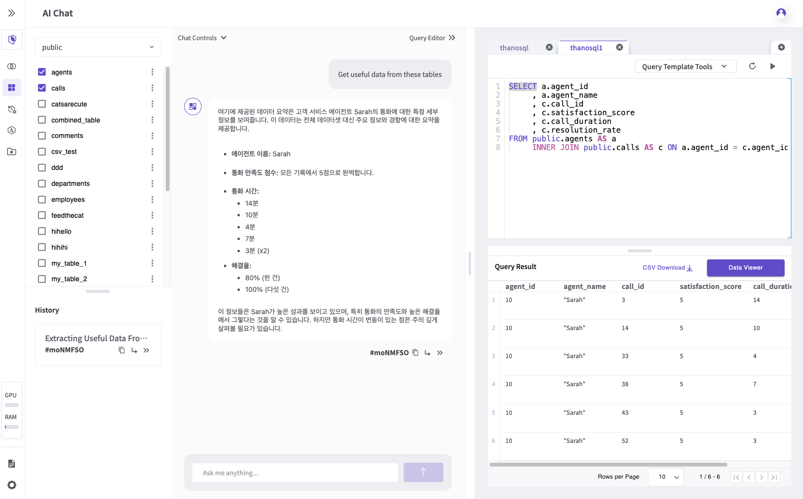
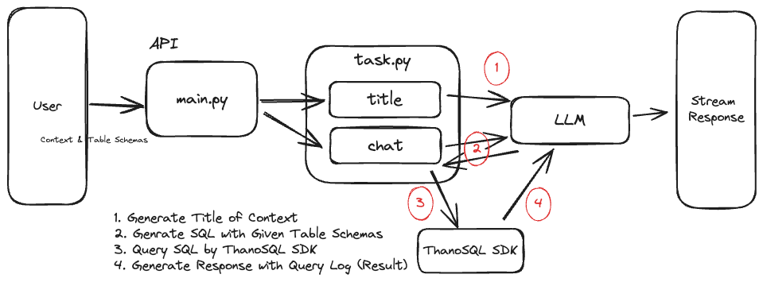

Backend service for AI Chat, an additional application within ThanoSQL Workspace.



## Overview

This backend service powers the AI Chat functionality in ThanoSQL Workspace. It provides the necessary API endpoints and infrastructure to enable real-time AI chat capabilities within your workspace environment.

## Getting Started

1. First, set up a ThanoSQL Workspace ([Free Trial](https://console.thanosql.com/products/workspace/create_workspace))

2. Host your AI Chat backend service

   > [!NOTE]
   > You can either self-host the service using the instructions below or [Contact Us](https://smartmind.team/contact/) for managed hosting solutions.

3. Configure the AI Chat:
   - Navigate to ThanoSQL's AI Chat > Chat Controls > General
   - Enter your hosted API URL in the API URL field

## Self-Hosting with Docker

### Prerequisites

- Docker and Docker Compose installed
- Git
- ThanoSQL Workspace account
- ngrok account (Recommended for quick and easy deployment without complex server setup)

### Installation

```bash
# Clone the repository
git clone --depth 1 https://github.com/smartmind-team/thanosql-chat

# Navigate to the docker directory
cd thanosql-chat/docker

# Create environment file
cp .env.example .env

# Configure environment variables
# Make sure to set Secrets:
# - ThanoSQL Workspace Engine URL
# - API Token, etc

# Start services in detached mode
docker compose up -d

# For deployment with ngrok (requires additional setup)
# Note: Add your ngrok authentication token to .env
docker compose --profile deploy up
```

### Verifying ngrok Deployment

After deploying with ngrok, retrieve your public API URL:

```bash
curl --silent http://localhost:4040/api/tunnels | jq '.tunnels[0].public_url'
```

### API Documentation

Interactive API documentation is available through Swagger UI:

- Local development: `http://127.0.0.1:8000/docs`
- Ngrok deployment: `https://{ngrok-url}/docs`

## Function Definitions

AI chat capabilities are defined through SQL functions. These functions are configured in the Redis component:

- Function metadata and structure: [`functions.json`](docker/redis/functions.json)
- SQL function implementations: [`functions.sql`](docker/redis/functions.sql)

For detailed information about function configuration, implementation, and management, refer to the [Redis README](docker/redis/README.md).

## System Architecture

The following diagram illustrates the system flow:



## Development

For detailed information about development setup, guidelines, and contribution processes, please refer to [DEVELOPERS.md](DEVELOPERS.md).

## Support

If you need assistance with setup or encounter any issues:

1. Check the documentation in [DEVELOPERS.md](DEVELOPERS.md)
2. Review open/closed issues in the GitHub repository
3. Contact our support team through the provided channels

## License

This project is licensed under the MIT License - see the [LICENSE](LICENSE) file for details.
